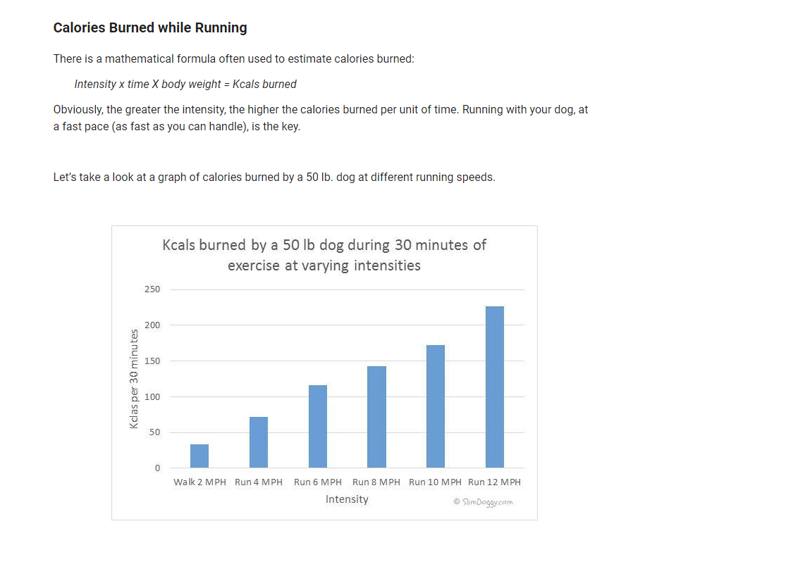
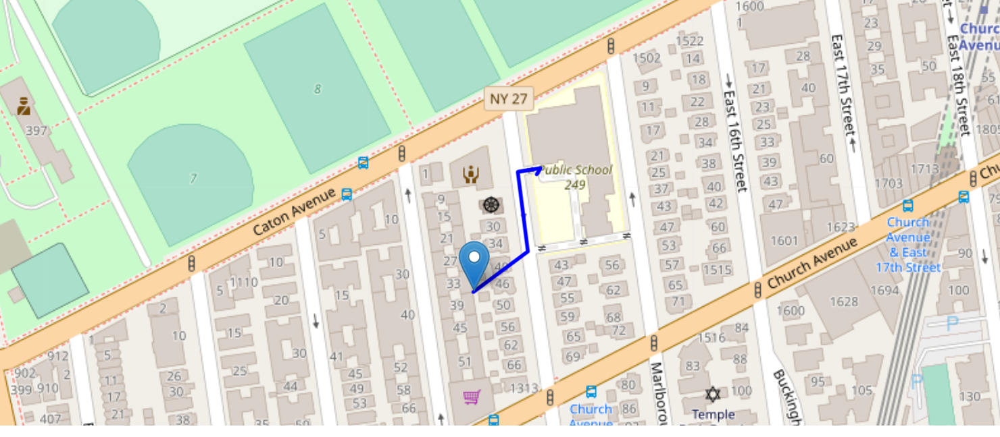

## Project pawWalk Overview as of 7.24.20

## Message Board
###### AJH
- We may want to think about switching away from react after demo day.  We're not using it to its full potential or the way that it's meant to.  I think we're more comfortable coding without worrying about State and JSX.  Ultimately react will slow us down and as of now I don't see any benefit to keep using it.  What do you guys think?
- We can take what we learned so far and think through a more detailed use case or problem that we want to solve.  The user-to-user  feature where a person can send a marker location to another via [websocket.io][15] or actual websocket tech.  How does this  feature target dog owners and not just anyone?  
- Dog owners may not know the name of a dog's owner but that's OK; it's enough to know that their dog's get along.  How do we put these people in contact while maintaining their 'dog-owner' anonymity.  Why wouldn't they just stay in touch by exchanging their phone number, email or other social media?  
- The dog's profile could offer a behavioral breakdown or report card e.g. Duke is high energy and loves to wrestle with others but isn't aggressive, Lola is friendly but doesn't like to play rough, Buttercup gets along with everyone except dogs bigger than him, etc.
- We could track and present the user with more detailed activity data from websites like [petnet](https://www.petnet.io/blogs/food/how-many-calories-does-my-dog-need) over the course of the day, week or month using tables and [Chart js][16].  I just thought I'd put some ideas out there.  I don't think I can figure the websocket tech out by demo day but it's the first thing on my list of things to do after the homework that I owe...

## Table of Contents

* [Project Summary](#Project-Summary)
* [Use Cases](#use-cases)
* [Main Functions](#Main-Functions)
* [Credits ](#credits)
* [In Development](#In-Development)
* [License [n/a]](#license)
* [Badges [n/a]](#badges)
* [Contributing](Contributing)
----
### Project Summary

As dog owners and enthusiasts, we were excited to create an app for dogs. We focused first and foremost on the dog and not the owner in terms of profile setup and usage. Currently there are around ~70 million American households with a dog but there isn’t a social media app that’s just for them.  For dog people - dogs are people and that’s where pawWALK can be used by owners to create a profile for their dog and give them the social benefits of many other human-centric social apps.

### Use Cases

#### Primary: 
pawWalk ("PW")
1. Redman is about to take Red out on his morning walk and needs to be home in an hour to get ready for work.  Red is high energy and needs long walks every day to stay happy and healthy.  However, if he gets to play or socialize with other dogs then he's ok with a shorter walk than usual.  Just in case some of Red's pals are available Redman decides to invite the usual crew.  
2. Redman opens PW, sets his return-home time limit to 8a.m., selects "Red's usual crew" and drops a marker on the map at the edge of the park.  Redman clicks "plan walk."  PW responds with (i) the most **direct route** on the map to the marked location from Redman's location, (ii) his **activity window**, which starts at his **arrival time** and ends when he must **return home** in order to make it back by 8 a.m. (7:15 a.m. - 7:45 a.m.) and (iii) the **RSVP status** for Red's pals. 
3. Redman clicks 'confirm' - at the same time Yellowman, Greenman and Blueman each receive the **direct route**, **activity window** and **RSVP status** relative to their respective locations.
4. Unfortunately Yellow is already on his walk and over an hour away from the marker.  After receiving the invite both Redman and Yellowman receive a notification that the plan won't work [unless Redman extends his **activity window**]; "they're too far away from each other."  
5. Green is just around the corner but Greenman already took him for a long run earlier.  After receiving the invite both Redman and Greenman receive a notification that the plan won't work [unless Redman and/or Greenman extend their **activity window**]; "bad timing."
- Blue is about to go home when he receives the same invitation.  He's only 10 minutes away from the marked location and free until Noon.  Blueman really wants to meetup because Blue and Red are BEST friends.  However, Blueman is useless without his morning coffee.  On the invite he clicks "edit route" and clicks a coffee symbol which provides an alternative route to the marker with a coffee shop along the way.  Blue's arrival time is now 7:25 a.m.
...this is where I got **TIRED**

---

#### Secondary: 

#### [n/a]: 

### Main Functions
[TOC](#Table-of-Contents)

#### Map
##### Current features:
    User can plot a route with continuous leaflet marker drops Marker A -> Marker B -> Marker C -> Marker D, etc.  Each marker *(notwithstanding starting marker A)* contains response data from [TravelTimeRoutes API](https://docs.traveltime.com/api/reference/routes) that includes the distance, traveltime and directions between each marker.  The route between two markers is composed of (at least one) "part(s)" where each part contains two key-value pairs of coordinates for that respective 'part' of the trip.  See the example route on the map below along with TravelTime response of results below.

    
     
     {
       results[0]
            .search_id: "exampleSearchA"
            .unreachable:[]          
            .locations[0]    
                .id: "next position"
                .properties[0]
                    .travel_time: 96                -->total travel time in seconds
                    .distance: 134                  -->total distance traveled in meters
                    .route
                        .arrival_time: "2020-07-24T18:29:07+02:00"          -->arrival time in UTC Time in ISO-8601 Format
                        .departure_time: "2020-07-24T18:29:07+02:00"        -->departure time in UTC Time in ISO-8601 Format
                        .parts[0]                 -->each part consists of two sets of coords representing first part of route A->B (the "Route")
                            .coords[0]                      -->starting position or marker A
                                .lat: 40.6487202
                                .lng: -73.9672143
                            .coords[1]                     -->end coords of first part of the Route and starting coords of second part (see below)
                                .lat: 40.6489743
                                .lng: -73.9668435
                            .direction: "northeast"
                            .directions: "Start your journey 48 meters northeast"
                            .distance: 48
                            .id: 0
                            .mode: "walk"
                            .travel_time: 30
                            .type: "start_end"
                        .parts[1]
                            .coords[0]                -->starting coords of second part and end of first part coords (see above)  
                                .lat: 40.6489743
                                .lng: -73.9668435
                            .coords[1]                  -->end coords of second part of the Route and starting coords of third part (see below)
                                .lat: 40.6494822
                                .lng: -73.9669394
                            .directions: "Walk 57 meters along Rugby Road"
                            .distance: 57
                            .id: 1
                            .mode: "walk"
                            .road: "Rugby Road"
                            .travel_time:12
                            .type: "road"
                        .parts[2]
                            .coords[0]                  -->starting coords of third part and end of second part coords (see above)
                                .lat: 40.6494822
                                .lng: -73.9669394
                            .coords[1]            
                                .lat: 40.6494991
                                .lng: -73.9668262
                            .coords[2]                  -->end coords of third part of the Route and starting coords of fourth part (see below)                     
                                .lat: 40.6495121
                                .lng: -73.9667388
                            .directions: "Turn right  and walk 17 meters"
                            .distance: 17
                            .id: 2
                            .mode: "walk"
                            .travel_time:12
                            .turn: "right"
                            .type: "road"
                        .parts[3]
                            .coords[0]                  -->starting coords of fourth part and end of third part coords (see above)
                                .lat: 40.6495121
                                .lng: -73.9667388
                            .coords[1]                      -->end coords of fourth and final part of the Route or marker B
                                .lat: 40.64934621158699
                                .lng: -73.96668632222011
                            .direction: "southeast"
                            .directions: "Your destination is 18 meters southeast"
                            .distance: 18
                            .id: 3
                            .mode: "walk"
                            .travel_time:13
                            .type: "start_end"
     }
                        
[TOC](#Table-of-Contents)

#### Dog Profiles

#### Data & Settings

### Credits

1. Group project:
- Abdibasid
- Arthur
- Simon

2. Tools/resources used: 
  - [bcrypt][1]
  - [dotenv][2]
  - [express][3]
  - [if-env][4]
  - [ignore-styles][5]
  - [jest][6]
  - [leaflet][7]
  - [mongoose][8]
  - [multer][9]
  - [multer-gridfs-storage][10]
  - [passport][11]
  - [react-images-upload][12]
  - [react-leaflet][13]
  - [react-leaflet-fullscreen][14]

3.	Tutorials used: 
  

----
### In Development
#### feature description
#### checklist status
#### issues (if applicable)

* [1. HTML Routes](#heading)
* [2. Store and Retrieve Notes](#heading-1)
* [3. API Routes](#heading-2)
* [4. UVI](#heading-3)
* [5. Five-day-forecast](#heading-4)
* [6. search-history-w/-links](#heading-5)
* [7. dash-opens-with-last-search](#heading-6)

#### 1. HTML Routes

##### feature description: the following HTML routes should be created:

- [x] complete GET `/notes` - Should return the `notes.html` file.

- [x] complete GET `*` - Should return the `index.html` file

### License

n/a

### Badges

n/a

### Contributing

#### Abdibasid
#### Arthur
#### Simon

[Contributor Covenant](https://www.contributor-covenant.org/)

###### [link references]

[1]: https://www.npmjs.com/package/bcrypt
[2]: https://www.npmjs.com/package/dotenv
[3]: https://www.npmjs.com/package/express
[4]: https://www.npmjs.com/package/if-env
[5]: https://www.npmjs.com/package/ignore-styles
[6]: https://www.npmjs.com/package/jest
[7]: https://leafletjs.com/reference-1.6.0.html
[8]: https://www.npmjs.com/package/mongoose
[9]: https://www.npmjs.com/package/multer
[10]:https://www.npmjs.com/package/multer-gridfs-storage
[11]: http://www.passportjs.org/packages/passport-npm/
[12]:https://www.npmjs.com/package/react-images-upload
[13]:https://www.npmjs.com/package/react-leaflet
[14]:https://www.npmjs.com/package/react-leaflet-fullscreen
[15]:https://www.npmjs.com/package/websocket.io
[16]:https://www.chartjs.org/samples/latest/

